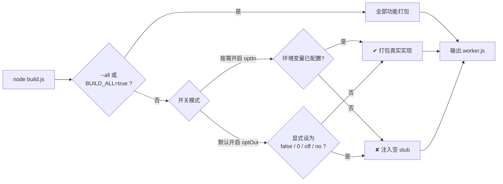

# 部署指南

本项目支持三种部署方式：GitHub Actions 自动部署、Cloudflare 控制台单文件部署，以及本地 Wrangler CLI 部署。

---

## 方式一：GitHub Actions 自动部署（推荐）

### 1. 准备凭据并配置 GitHub

环境变量分三部分存放，职责固定：

| 存放位置 | 放什么 | 部署行为 |
| :--- | :--- | :--- |
| **GitHub Secrets（机密）** | 部署凭据 | 只用于部署流程，不进入 Worker 运行时 |
| **GitHub Variables（文本）** | 非敏感业务配置 | 每次部署自动注入 Worker（wrangler `vars`） |
| **Cloudflare Worker 密钥（加密）** | 敏感业务凭据 | 配置一次即可，之后每次部署自动保留 |

> **为什么敏感配置必须放 Cloudflare 密钥**：`wrangler deploy` 携带 `vars` 时，会用配置里的明文变量整体替换 Worker 上的明文变量——在 Cloudflare 控制台手工配置的明文变量，下一次部署后就会被清掉；加密密钥（Secret）不受部署影响。因此不要在 Cloudflare 控制台手工维护明文变量。

#### A. 获取 Cloudflare 必要凭据
- **Account ID**：登录 Cloudflare，进入 **Compute (Workers) -> Workers & Pages**，右侧栏复制 Account ID。
- **KV ID**：进入 **Storage & Databases -> KV**，复制 `nfd` 命名空间的 32 位 ID。
- **API Token**：右上角 **头像 -> My Profile -> API Tokens**，创建具备 Workers 编辑权限的 Token。

#### B. GitHub Secrets（仅部署凭据）
进入仓库 **Settings -> Secrets and variables -> Actions -> Secrets**：

| 名称 | 说明 |
| :--- | :--- |
| `CF_API_TOKEN` | Cloudflare API 令牌（具备 Workers 编辑权限） |
| `CF_ACCOUNT_ID` | Cloudflare 账户 ID |
| `KV_NAMESPACE_ID` | `nfd` KV 命名空间的 32 位 ID |

> 工作流只从 Secrets 读取这三项：把它们配置成 Variables 不会生效；反过来，业务变量放进 Secrets 也不会被读取（防止敏感信息以明文注入 Cloudflare）。

#### C. GitHub Variables（非敏感业务配置）
进入 **Settings -> Secrets and variables -> Actions -> Variables**：

| 名称 | 说明 | 示例 |
| :--- | :--- | :--- |
| `ENV_FORWARD_CHAT_ID` | （可选）接收留言的群聊 ID | `-1004358728615` |
| `ENV_ALERT_THREAD_ID` | （可选）拦截通知的话题 ID | `9` |
| `ENV_ENABLE_FORUM_TOPICS` | （可选）是否开启多话题模式 | `true` |
| `ENV_FORWARD_DELAY_SECONDS` | （可选）转发延迟秒数 | `5` |
| `ENV_LISTEN_CHAT_IDS` | （可选）监听群/频道白名单（逗号分隔） | `-1001111111111,-1002222222222` |
| `ENV_BOT_COMMANDS` | （可选）自定义命令菜单（简写或 JSON 格式，同时用于构建裁剪） | `panel:控制面板,stats:统计数据` |
| `ENV_ENABLE_PUSHDEER` | （可选）PushDeer 通道参与构建裁剪（密钥只存 Cloudflare 密钥时用） | `true` |
| `ENV_ENABLE_SERVERCHAN` | （可选）Server酱 通道参与构建裁剪（密钥只存 Cloudflare 密钥时用） | `true` |

> 上表只列部署时常用的变量。全部环境变量已按「基础配置 / 转发与告警 / 监听模式 / 审查与防护 / 关键词拦截 / 提示与回执 / 命令菜单 / 外部推送 / 文案与数据源」九类整理，完整说明见[配置手册 · 环境变量](configuration.md#环境变量)。
>
> 工作流只从 Variables 读取业务变量：把它们配成 Secrets 会被忽略——敏感凭据请配置到 Cloudflare 密钥（第 3 步）。
>
> 敏感凭据（`ENV_BOT_TOKEN` / `ENV_BOT_SECRET` / `ENV_ADMIN_UID`）不配置在 GitHub，见下方第 3 步。

### 2. 触发首次部署

推送代码至 `main` 分支，或在 GitHub **Actions** 页面点击 **Deploy to Cloudflare Workers -> Run workflow**。
GitHub Actions 将自动在 Cloudflare 上创建并发布 Worker 服务。

### 3. 在 Cloudflare 配置加密密钥（第三部分）

登录 Cloudflare 控制台，进入 **Compute (Workers) -> Workers & Pages -> nfd -> 设置 -> 变量和机密**，点击 **添加变量**，添加以下变量并点击右侧 **加密（Encrypt）** 保存：

| 变量名 | 说明 | 示例 |
| :--- | :--- | :--- |
| `ENV_BOT_TOKEN` | Telegram Bot Token | `123456:ABC...` |
| `ENV_BOT_SECRET` | 自定义 Webhook 访问密钥 | `your-secret-key` |
| `ENV_ADMIN_UID` | 管理员的 Telegram 纯数字 UID | `1331096600` |

> **迁移提示**：如果你此前把 `ENV_ADMIN_UID` 配置在 GitHub（Secret 或 Variable），请按上表改配到 Cloudflare 加密密钥——当前部署流程不再从 GitHub 注入它，缺配会导致下次部署后管理员识别失效。
>
> 推送密钥（`ENV_PUSHDEER_KEY` / `ENV_SERVERCHAN_KEY`）同样属于敏感凭据，也可以只配置在这里：同时在 GitHub Variables 把对应的 `ENV_ENABLE_PUSHDEER` / `ENV_ENABLE_SERVERCHAN` 设为 `true`，让通道参与构建裁剪。

### 4. 激活 Webhook

在浏览器访问以下地址：
```text
https://你的worker域名/registerWebhook?secret=你的ENV_BOT_SECRET
```
返回 `Ok` 即完成机器人注册与上线。

---

## 方式二：Cloudflare 单文件部署

1. 在本地打包生成 `worker.js`：
   ```bash
   node build.js
   ```
2. 在 Cloudflare 创建 Worker，绑定 KV（变量名 `nfd`），并在设置中添加环境变量。
3. 将生成的 `worker.js` 内容复制粘贴到 Worker 在线编辑器并部署。
4. 访问注册地址激活 Webhook：
   ```text
   https://你的worker域名/registerWebhook?secret=你的ENV_BOT_SECRET
   ```

---

## 方式三：Wrangler CLI 部署

1. 安装依赖并配置密钥：
   ```bash
   npm install
   npx wrangler secret put ENV_BOT_TOKEN
   npx wrangler secret put ENV_BOT_SECRET
   npx wrangler secret put ENV_ADMIN_UID
   ```
2. 执行部署：
   ```bash
   npx wrangler deploy
   ```
3. 访问 `/registerWebhook?secret=你的ENV_BOT_SECRET` 激活 Webhook。

---

## 可选：定时触发器（cron）

转发延迟（`ENV_FORWARD_DELAY_SECONDS`）依赖 Worker 在 `waitUntil` 中内联等待，而 Worker 单次请求最长存活约 30 秒，超过 25 秒的延迟会被截断。若进程在等待期间被回收，KV 中遗留的延迟批次由定时触发器兜底补发：

在 `wrangler.jsonc` 中取消注释（或通过 Cloudflare 控制台 -> Worker -> 设置 -> 触发事件 -> Cron 触发器添加）：

```jsonc
"triggers": {
  "crons": ["*/1 * * * *"]
}
```

建议频率为每分钟一次。使用 GitHub Actions 或控制台在线部署时，可在 Cloudflare 控制台直接添加 Cron 触发器。

---

## 按需打包（构建裁剪）机制

单文件部署使用的 `worker.js` 由 `node build.js` 从 `src/` 打包生成。可选功能遵循**「环境变量未配置就不参与打包」**的原则：构建时未命中的模块会被等价的空实现（stub）替代，真实代码不进入最终产物，Worker 体积更小。

### 功能开关总览

| 功能 | 开关环境变量 | 开关模式 | 默认状态 | 裁剪后的行为 |
| :--- | :--- | :--- | :--- | :--- |
| PushDeer 推送 | `ENV_PUSHDEER_KEY` 或 `ENV_ENABLE_PUSHDEER=true` | 按需开启 | 不打包 | 不推送任何外部通知 |
| Server酱 推送 | `ENV_SERVERCHAN_KEY` 或 `ENV_ENABLE_SERVERCHAN=true` | 按需开启 | 不打包 | 不推送任何外部通知 |
| Bot 命令菜单 | `ENV_BOT_COMMANDS` | 按需开启 | 不打包 | 不注册 `/` 命令菜单 |
| 论坛话题自动创建 | `ENV_ENABLE_FORUM_TOPICS` | 按需开启 | 不打包 | 不自动创建话题（留言仍正常转发） |
| 远程自定义文案 | `ENV_START_MESSAGE_URL` / `ENV_NOTIFICATION_URL`（任一） | 按需开启 | 不打包 | 使用 `data/` 内置默认文案 |
| 诈骗库检测 | `ENV_ENABLE_FRAUD_CHECK` | 默认开启 | 打包 | 等同关闭：命中诈骗库不再报警 |

- **按需开启**（optIn）：构建时配置了变量 → 打包真实实现；未配置 → 注入 stub。适合默认关闭的功能。
- **默认开启**（optOut）：默认打包；构建时显式设为 `false` / `0` / `off` / `no` 才裁剪。适合默认开启的功能。

### 构建决策流程



每次构建都会输出产物构成清单，例如：

```text
Bundling src/*.js into worker.js...
  ✘ 外部推送通道 -> stub
  ✘ Bot 命令菜单 (commands.js) -> stub
  ✔ 论坛话题自动创建 (forum.js)
  ✔ 远程自定义文案 (remote-text.js)
  ✔ 诈骗库检测 (fraud.js)
Successfully generated worker.js (82450 bytes)
```

### 使用要点

1. **GitHub Actions 部署**：将开关变量配置为仓库 Variables（机密只放部署凭据，业务变量一律用明文 Variables），工作流会同时提供给构建步骤与运行时（wrangler `vars`），裁剪结果与运行行为自动一致；
2. **单文件部署**：在本地构建前导出对应变量，例如：
   ```bash
   ENV_BOT_COMMANDS='panel:控制面板' ENV_ENABLE_FORUM_TOPICS=true node build.js
   ```
3. **全量产物**：`node build.js --all`（或设置 `BUILD_ALL=true`）强制打包全部可选模块；`npm test` 会对「裁剪」与「全量」两种产物分别做语法检查与导入冒烟测试；
4. **运行时变量无法唤醒已被裁剪的模块**：只在 Cloudflare 控制台配置变量、构建时未配置的话，需要按上述方式重新构建部署。

### 新增可裁剪功能

在 `build.js` 的 `FEATURE_MODULES` 注册表中登记一条即可，无需改动其他构建逻辑：

```js
const FEATURE_MODULES = [
  // ... 已有条目 ...
  {
    name: '功能显示名',
    file: 'your-feature.js',            // src/ 下的模块文件
    mode: 'optIn',                      // optIn=配置即打包 / optOut=默认打包、显式关闭才裁剪
    envs: ['ENV_YOUR_FEATURE_SWITCH'],  // 开关变量（optOut 只取第一个）
    stub: 'export function yourApi() { return null; }', // 导出名与签名需与真实模块一致
  },
];
```

> 注意：stub 的导出名与签名必须与真实模块保持一致，调用方无需感知裁剪；可选模块的顶层代码不能依赖其他可选模块的导出（未打包时该标识符不存在）。

---

## 安全注意事项

- **务必配置 `ENV_BOT_SECRET`**：未配置时 Webhook 处于无鉴权状态，任何人都可以向 `/endpoint` 伪造 Telegram 更新（Worker 日志会输出对应警告）。
- **`/registerWebhook` 支持三种传参方式**：URL 参数 `?secret=`、请求头 `X-Telegram-Bot-Api-Secret-Token` 或 `x-secret`。其中 URL 参数会随访问记录进入浏览器历史与访问日志，公网环境下更推荐用请求头方式携带密钥；若确有泄露风险，应立即更换 `ENV_BOT_SECRET` 并重新注册 Webhook。

---

## 常见问题

- **部署提示 Unauthorized**：检查 `CF_API_TOKEN` 是否具备 `Workers: Edit` 权限，且 `CF_ACCOUNT_ID` 填写正确。
- **配置了变量但没生效**：检查存放位置——部署凭据（`CF_API_TOKEN` / `CF_ACCOUNT_ID` / `KV_NAMESPACE_ID`）只读 GitHub Secrets，业务变量只读 GitHub Variables（配成 Secrets 会被忽略），敏感凭据（`ENV_BOT_TOKEN` / `ENV_BOT_SECRET` / `ENV_ADMIN_UID`）只认 Cloudflare 加密密钥。
- **Webhook 提示 Unauthorized**：检查访问链接中的 `?secret=` 参数是否与配置的 `ENV_BOT_SECRET` 一致。
- **收不到留言**：确认 `ENV_ADMIN_UID` 为纯数字 ID，且 KV 绑定变量名为 `nfd`。
